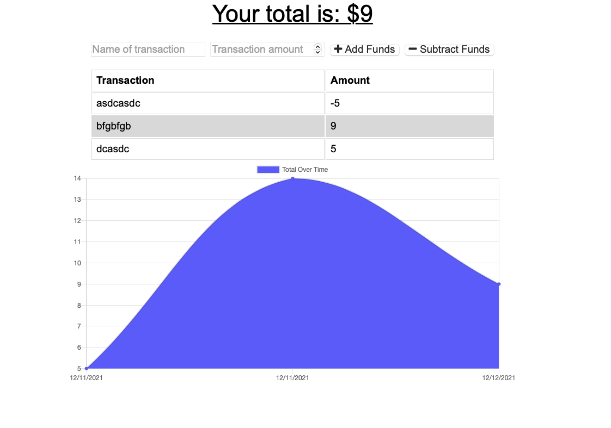

# budget-tracker

This is a simple application that allows the user to add and track spending items to manage their budget. As the user enters in spend items, the budget tracker will add it to the list and update the graph below. This is a great tool for keeping track of how spending is coming in against a person's budget, whether on travel, a home project, or a new business venture.

The best part is that this application functions both online and offline!

## Accessing the application
This application is deployed via Heroku. Below are links to the deployed application as well as the github repo.

**Deployed Heroku App:**  

**Github Repo:** https://github.com/bckasper/budget-tracker

## Instructions for use
**Below is a detailed breakdown of how this application works:**

1. The user will first open the application using the links above. If this is the user's first time using the application, they will see a clean sheet where they can begin to fill in spend items. 

2. The user will then enter the name of a transaction in, choose the transaction amount using the up/down arrows, and then add or subtract the items from the budget.

3. When the user is done, they can exit the application.

4. Upon returning, either with or without internet, the user will be able to access their stored items and continue inputing items for the budget tracker.

## Screenshot of Budget Tracker
 

## Contributors
This was a solo project developed by me.

## Technology used in this application
1. Heroku (https://dashboard.heroku.com/apps)

2. MongoDB (https://www.mongodb.com)

3. Mongoose (https://mongoosejs.com)

4. npm (https://www.npmjs.com)